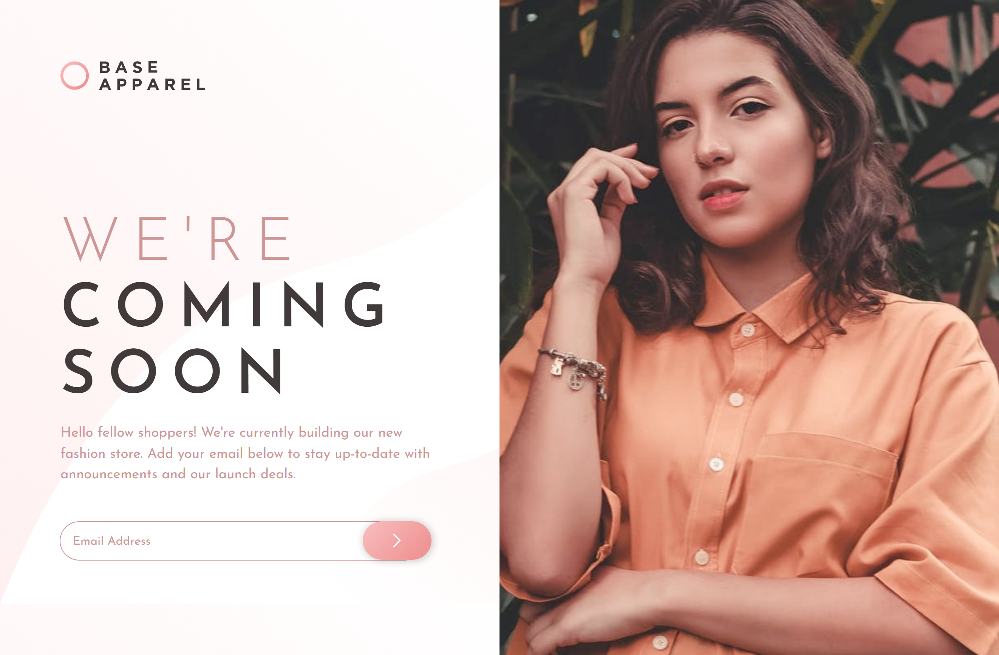

# Frontend Mentor - Base Apparel coming soon page 

This is a solution to the [Base Apparel coming soon page challenge on Frontend Mentor](https://www.frontendmentor.io/challenges/base-apparel-coming-soon-page-5d46b47f8db8a7063f9331a0). 

## Table of contents

- [Overview](#overview)
  - [The challenge](#the-challenge)
  - [Screenshot](#screenshot)
  - [Links](#links)
- [My process](#my-process)
  - [Built with](#built-with)
  - [What I learned](#what-i-learned)
  - [Continued development](#continued-development)
  - [Useful resources](#useful-resources)
- [Author](#author)

## Overview

### The challenge

Users should be able to:

- View the optimal layout for the site depending on their device's screen size
- See hover states for all interactive elements on the page
- Receive an error message when the `form` is submitted if:
  - The `input` field is empty
  - The email address is not formatted correctly

### Screenshot

#### Desktop


##### Stats active


#### Mobile


### Links

- Solution URL: [This is the solution as seen from Frontend Mentor]().coming soon
- Live Site URL: [Live solution](https://boudgnosis.github.io/base-apparel-coming-soon/).

## My process

### Built with

- Semantic HTML5 markup
- CSS custom properties
- Flexbox
- Desktop-first workflow
- Transitions
- Media queries
- Pseudo-classes
- JavaScript vanilla
- [Google Fonts](https://fonts.google.com/) - Interactive directory of typefaces in local
- [Normalize](https://necolas.github.io/normalize.css/) - It makes browsers render all elements more consistently and according to modern standards.

### What I learned

- Use the `match()` function to search for the string the user enters and check with the `regExp` that I store in an object to verify if there is a match and return a message to the user.

```js
const BTN = document.getElementById("btn__form")
const EMAIL = document.getElementById("email")

const REGEX = {
  email: /^\w+([\.-]?\w+)*@\w+([\.-]?\w+)*(\.\w{2,3})+$/,
};

BTN.addEventListener("click", (e) => {
  if (EMAIL.value.match(REGEX.email)) {
    console.log('Email correcto 🐰')
  } else {
    console.log('Email incorrecto 🐰')
  }
}

```

- I also learned the basic use of the .gitignore file.

### Continued development

I continue learning how to manipulate the DOM, since this time I only used this method: `ERROR_NAME.innerHTML = "Please provide a valid email"`
    `EMAIL.style.outline = "3px solid hsl(0, 93%, 68%)"`
    `IMG_ERROR.style.display = 'block'`, to manipulate the styles and the elements that were displayed.

### Useful resources

- [Función JavaScript MATCH()](https://es.acervolima.com/funcion-javascript-match/)
- [Guías de Make it Real](https://guias.makeitreal.camp/git/gitignore)

## Author

- Codepen - [@boudgnosis](https://codepen.io/boudgnosis)
- Frontend Mentor - [@boudgnosis](https://www.frontendmentor.io/profile/boudgnosis)
- Twitter - [@juan_ariasd](https://twitter.com/juan_ariasd)
- Dev - [@juan_duque](https://dev.to/juan_duque)
- Linkedink - [juan pablo arias duque](https://www.linkedin.com/in/jpariasduque/)
